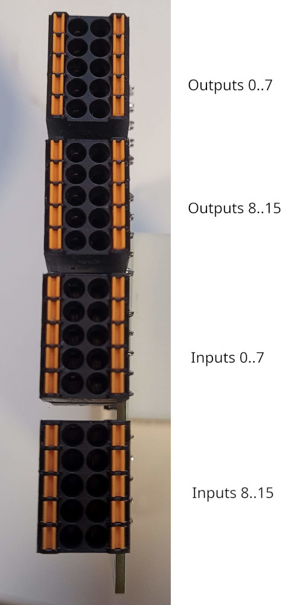

# rioctrl-shiftio

This module provides the following IOs:
* 16 opto-isolated digital outputs (PNP, external voltage input 5-24V in two groups). Each output is capable of sourcing ~0.6A of current and has over-current protection.
* 16 opto-isolated digital inputs (12-24V, both sourcing and sinking connections are possible).

Due to slot width limitations, each group of outputs (4 in total) are fitted with spring-type pluggable terminal blocks (LCSC part number:
[C2908401](https://www.lcsc.com/product-detail/Pluggable-System-Terminal-Block_JILN-JL15EDGKNH-35005B01_C2908401.html)).

# Pinout

## Pinout of output blocks

VCC is 5..24V DC. Each of the output blocks has a separate power supply, so for example
one block can be 5V outputs and another one- 24VDC.

| VCC  | GND  |
|------|------|
| 0    | 1    |
| 2    | 3    |
| 4    | 5    |
| 6    | 7    |

| VCC | GND |
|-----|-----|
| 8   | 9   |
| 10  | 11  |
| 12  | 13  |
| 14  | 15  |

## Pinout of input blocks

Common input can be either ground, or positive voltage of 12..24VDC for sourcing or 
sinking type outputs.

Limited testing has shown that inputs also work at 5V output level, but that's not really guaranteed with the
values of components in current design.

|   | Common |
|---|---------|
| 0 | 1       |
| 2 | 3       |
| 4 | 5       |
| 6 | 7       |

|  | Common |
|-----|--------|
| 8   | 9      |
| 10  | 11     |
| 12  | 13     |
| 14  | 15     |
