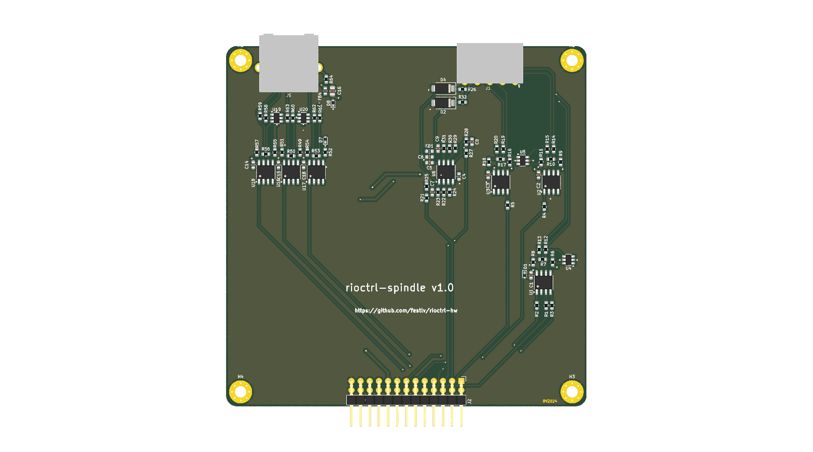
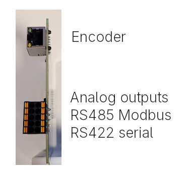

# rioctrl-spindle

This module provides:
* 2 analog outputs (0..10V)
* RS-485 interface for Modbus
* RS-422 interface (for full-duplex serial communication, pending software support)
* Differential encoder interface

__Only analog outputs and Modbus has been tested!__

## Pinout

|       |          |
|-------|----------|
| AIN0  | GND      |
| AIN1  | SER_TX_A |
| MODBUS_A | SER_TX_B |
| MODBUS_B | SER_RX_A |
| x     | SER_RX_B |

# Changelog

## v1.0
Initial released version.
